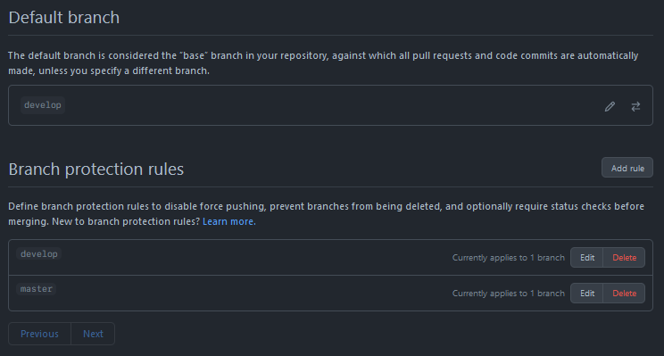
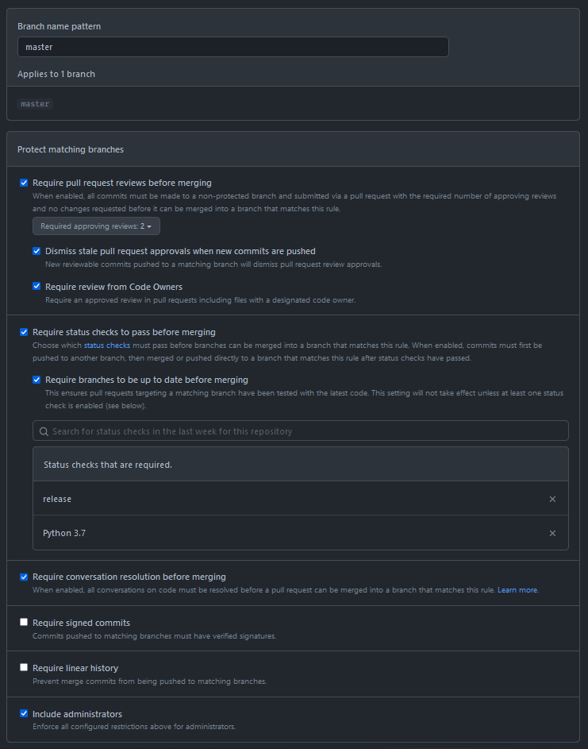
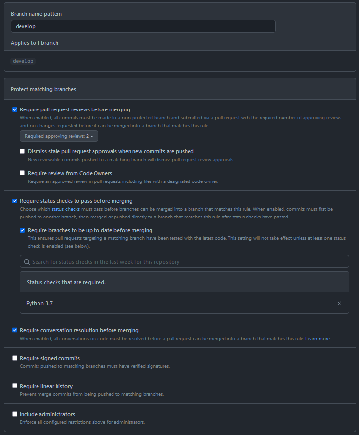

# DevOps Template (GitFlow + GitHub Actions)

This repository exists to be able to test how to configure GitHub to
enforce/automate a GitFlow process.

## Necessary Configuration

1. Clone the project

2. Set the default branch to `develop`. This makes it easier for developers to
   target the develop branch for PRs instead of defaulting to `master`.

   

3. Set branch-access rules for `master` and `develop` branches:

    | Master | Develop |
    | --- | --- |
    |  | 

4. Ensure `.github/scripts/extract_version.sh` has elevated privileges by
   running:

   ```bash
   git update-index --chmod=+x .github/scripts/extract_version.sh
   ```
